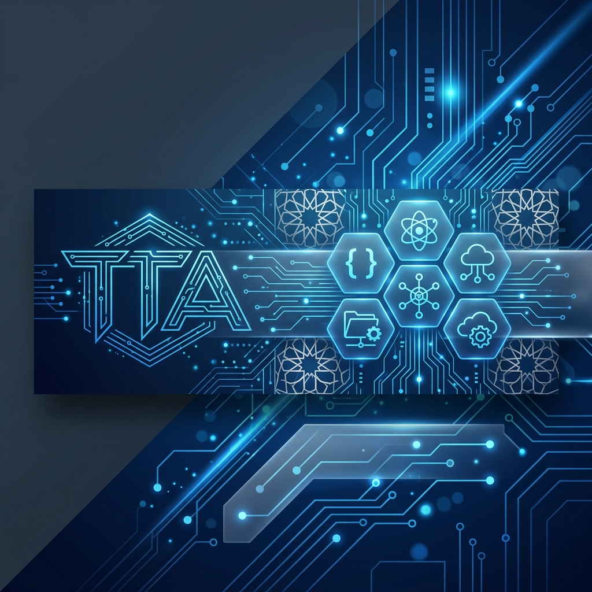

# tech-turkiye-awesome 🚀

Türkiye'deki teknoloji ekosistemine dair kurumsal yetenek programları, yerli yazılım çözümleri ve mühendislik inisiyatiflerinin kürate edilmiş profesyonel bir listesidir.

Bu deponun amacı; öğrencilerin, mühendislerin ve teknoloji meraklılarının Türkiye'deki teknolojik imkanlara ve yerli üretim yazılımlara tek bir noktadan ulaşmasını sağlamaktır.

---

## 📂 İçindekiler
* [🎓 Akademik & Kariyer Programları](#akademik--kariyer-programları)
* [🏠 Akıllı Ev & Donanım (IoT)](#akıllı-ev--donanım-iot)
* [🔓 Açık Kaynak & Topluluk Projeleri](#açık-kaynak--topluluk-projeleri)
* [⛓️ Blokzinciri & Kripto](#blokzinciri--kripto)
* [☁️ Bulut Bilişim & Veri Merkezi](#bulut-bilişim--veri-merkezi)
* [🛒 E-Ticaret & Lojistik Teknolojileri](#e-ticaret--lojistik-teknolojileri)
* [🎓 Eğitim Teknolojileri (EdTech)](#eğitim-teknolojileri-edtech)
* [🔋 Enerji & Sürdürülebilirlik](#enerji--sürdürülebilirlik)
* [💳 Fintech & Ödeme Sistemleri](#fintech--ödeme-sistemleri)
* [🤝 Kurumsal İletişim & İş Birliği](#kurumsal-iletişim--iş-birliği)
* [🚗 Mobilite & Otomotiv](#mobilite--otomotiv)
* [🎮 Oyun Geliştirme (Game Dev)](#oyun-geliştirme-game-dev)
* [🛠️ SaaS & Geliştirici Araçları](#saas--geliştirici-araçları)
* [🛡️ Savunma Sanayii](#savunma-sanayii)
* [🏥 Sağlık Teknolojileri (HealthTech)](#sağlık-teknolojileri-healthtech)
* [🛡️ Siber Güvenlik & Altyapı](#siber-güvenlik--altyapı)
* [🤖 Yapay Zeka & Veri Bilimi](#yapay-zeka--veri-bilimi)

---

## 🎓 Akademik & Kariyer Programları
Mühendislik öğrencileri ve yeni mezunlar için sunulan gelişim ve mentorluk programları.

* **[ASELSAN a-Yetenek](https://www.aselsan.com/tr/kariyer/a-yetenek)** - Genç yetenekler için kapsamlı kariyer ve gelişim süreci.
* **[BAYKAR Akıncı Gelişim Programı](https://kariyer.baykartech.com/)** - Savunma sanayi odaklı mühendislik eğitimleri.
* **[HAVELSAN SUİT](https://www.havelsan.com.tr/suit)** - Siber Uzmanlık, İnovasyon ve Teknoloji programı. Bitirme projeleri ve mentorluk desteği.
* **[ROKETSAN Yetenek Programları](https://www.roketsan.com.tr/tr/kariyer/yetenek-programlari)** - Savunma sanayinde kariyer yapmak isteyen gençler için staj ve aday mühendislik imkanları.
* **[TUSAŞ SKY Experience](https://www.tusas.com/kariyer/genc-yetenek-programlari)** - Türk Havacılık ve Uzay Sanayii staj ve aday mühendislik programı.
* **[TÜBİTAK STAR](https://star.tubitak.gov.tr/)** - Stajyer Araştırmacı Burs Programı.

## 🏠 Akıllı Ev & Donanım (IoT)
Donanım tasarımı, akıllı ev sistemleri ve tüketici elektroniği çözümleri.

* **[Arçelik Ar-Ge](https://www.arcelikglobal.com/tr/ar-ge-tasarim/)** - Beyaz eşya ve IoT alanında öncü mühendislik çalışmaları.
* **[Reeder](https://reeder.com.tr/)** - Yerli akıllı telefon ve tablet üreticisi.
* **[Vestel Ar-Ge](https://www.vestel.com.tr/vestel-ar-ge)** - Tüketici elektroniği ve mobil cihazlar için teknoloji geliştirme merkezi.

## 🔓 Açık Kaynak & Topluluk Projeleri
Türkiye merkezli veya Türk geliştiriciler tarafından öncülük edilen açık kaynak projeler.

* **[Made in Turkey](https://github.com/IonicaBizau/made-in-turkey)** - Türkiye'de geliştirilen projelerin kürate edilmiş listesi.
* **[Turkish NLP Resources](https://github.com/agmmnn/turkish-nlp-resources)** - Türkçe Doğal Dil İşleme araçları ve veri setleri.
* **[Türkiye Açık Kaynak Platformu](https://www.turkiyeacikkaynakplatformu.com/)** - Türkiye'nin açık kaynak yazılım ekosistemini geliştirmeyi amaçlayan platform.
* **[Türkiye Açık Veri Kaynakları](https://github.com/kaymal/acik-veri)** - Türkiye'deki açık veri platformları ve veri setleri listesi.

## ⛓️ Blokzinciri & Kripto
Finansın geleceği ve merkeziyetsiz teknolojiler üzerine çalışan platformlar.

* **[BiLira](https://www.bilira.co/)** - Türk Lirası'na endeksli ilk stabil kripto para.
* **[BtcTurk](https://www.btcturk.com/)** - Türkiye'nin ilk ve en büyük kripto para işlem platformu.
* **[Metatime](https://metatime.com/)** - Kapsamlı blokzinciri ekosistemi ve Web3 çözümleri.
* **[Paribu](https://www.paribu.com/)** - Güvenilir ve hızlı kripto para alışverişi platformu.

## ☁️ Bulut Bilişim & Veri Merkezi
Veri yerliliği ve yerel bulut hizmetleri sağlayıcıları.

* **[Bulutistan](https://bulutistan.com/)** - Türkiye'nin en büyük yerli bulut servis sağlayıcılarından biri.
* **[GlassHouse](https://www.glasshouse.com.tr/)** - Bulut hizmetleri ve kurumsal veri yedekleme çözümleri.
* **[Radore](https://radore.com/)** - Modern veri merkezi ve bulut hizmetleri sağlayıcısı.
* **[Turkcell Bulut](https://turkcellbulut.com/)** - Kurumsal veri depolama, işleme ve felaket kurtarma çözümleri.

## 🛒 E-Ticaret & Lojistik Teknolojileri
Dijital ticaret ve teslimat dikeyindeki dev platformlar.

* **[Getir](https://getir.com/)** - "Ultrafast delivery" kavramının öncüsü global Türk girişimi.
* **[Hepsiburada Tech](https://www.hepsiburada.com/)** - Nasdaq'ta işlem gören ilk Türk şirketi olan Hepsiburada'nın teknoloji merkezi.
* **[Trendyol Tech](https://trendyol.com/)** - Türkiye'nin ilk decacorn'u Trendyol'un devasa mühendislik ekibi.

## 🎓 Eğitim Teknolojileri (EdTech)
Dijital öğrenme ve sınav hazırlık platformları.

* **[Doping Hafıza](https://www.dopinghafiza.com/)** - Yapay zeka destekli sınav hazırlık ve öğrenme platformu.
* **[Kunduz](https://kunduz.com/)** - Öğrenciler için anında soru çözüm ve ders desteği uygulaması.
* **[MentalUP](https://www.mentalup.net/)** - Çocuklar için geliştirilmiş bilimsel ve eğitici oyun platformu.

## 🔋 Enerji & Sürdürülebilirlik
Yenilenebilir enerji, depolama ve akıllı şebeke teknolojileri.

* **[Aspilsan Enerji](https://www.aspilsan.com/)** - Pil ve batarya teknolojilerinde Türkiye'nin öncü kuruluşu.
* **[Kontrolmatik](https://www.kontrolmatik.com/)** - Enerji üretimi, iletimi ve endüstriyel otomasyon çözümleri.
* **[Yeo Teknoloji](https://www.yeo.com.tr/)** - Enerji ve dijitalleşme odaklı mühendislik projeleri.

## 💳 Fintech & Ödeme Sistemleri
Finansal teknolojiler alanında öncü yerli girişimler.

* **[Colendi](https://www.colendi.com/)** - Mikro kredi ve skorlama odaklı fintech platformu.
* **[Figopara](https://figopara.com/)** - Tedarikçi finansmanı ve nakit akışı yönetimi platformu.
* **[Iyzico](https://www.iyzico.com/)** - E-ticaret şirketleri için ödeme altyapısı sağlayıcısı.
* **[Midas](https://www.getmidas.com/)** - Amerikan ve Türk borsalarına yatırım yapmayı kolaylaştıran uygulama.
* **[Papara](https://www.papara.com/)** - Yeni nesil finans uygulaması ve dijital cüzdan.

## 🤝 Kurumsal İletişim & İş Birliği
Güvenli veri paylaşımı ve iletişim odaklı yerli çözümler.

* **[BİP Meet](https://www.bipmeet.com/)** - Güvenli video konferans ve toplantı çözümü.
* **[HAVELSAN İLETİ](https://www.havelsan.com.tr/sektorler/bilisim-ve-akademi/bilgi-ve-iletisim-teknolojileri/havelsan-ileti)** - Yüksek güvenlikli, kurumsal mesajlaşma platformu.
* **[OctaChat](https://www.octachat.com/)** - Kurumsal mesajlaşma ve iş yönetimi uygulaması.

## 🚗 Mobilite & Otomotiv
Geleceğin ulaşım teknolojileri ve otonom sistemler.

* **[BinBin](https://www.binbin.tech/)** - Mikromobilite ve elektrikli scooter kiralama hizmeti.
* **[Hop](https://hop.bike/)** - Paylaşımlı mikromobilite çözümleri.
* **[Martı](https://www.marti.tech/)** - Türkiye'nin öncü mobilite uygulaması ve NYSE'de işlem gören girişim.
* **[Togg](https://www.togg.com.tr/)** - Türkiye'nin küresel mobilite markası ve elektrikli otomobil projesi.

## 🎮 Oyun Geliştirme (Game Dev)
Global pazarda başarıya ulaşmış Türk oyun stüdyoları.

* **[Dream Games](https://dreamgames.com/)** - Royal Match ile globalde zirveye oynayan stüdyo.
* **[Masomo](https://www.masomo.com/)** - Online Kafa Topu serisinin yaratıcısı (Miniclip iştiraki).
* **[Peak Games](https://www.peak.com/)** - Toon Blast ve Toy Blast gibi hit oyunların yaratıcısı (Zynga iştiraki).
* **[Rollic Games](https://www.rollicgames.com/)** - Hyper-casual oyun pazarının liderlerinden (Zynga iştiraki).
* **[TaleWorlds Entertainment](https://www.taleworlds.com/)** - Efsanevi Mount & Blade serisinin geliştiricisi.

## 🛠️ SaaS & Geliştirici Araçları
Yazılım geliştirme süreçlerini kolaylaştıran çözümler.

* **[Firefly](https://firefly.ai/)** - Bulut altyapı yönetimi ve otomasyon araçları.
* **[Insider](https://useinsider.com/)** - Kişiselleştirilmiş müşteri deneyimi platformu (Unicorn).
* **[OpsGenie](https://www.opsgenie.com/)** - Olay yönetimi ve uyarı platformu (Atlassian iştiraki).

## 🛡️ Savunma Sanayii
Türkiye'nin mühendislik gücünü temsil eden savunma ve havacılık devleri.

* **[ASELSAN](https://www.aselsan.com/)** - Elektronik sistemler ve savunma teknolojileri lideri.
* **[BAYKAR](https://www.baykartech.com/)** - İnsansız Hava Aracı (İHA) teknolojilerinde dünya lideri.
* **[FNSS](https://www.fnss.com.tr/)** - Zırhlı kara araçları tasarım ve üretim merkezi.
* **[HAVELSAN](https://www.havelsan.com.tr/)** - Yazılım, simülasyon ve komuta kontrol sistemleri uzmanı.
* **[ROKETSAN](https://www.roketsan.com.tr/)** - Roket ve füze sistemleri teknolojileri merkezi.
* **[STM](https://www.stm.com.tr/)** - Deniz projeleri ve siber güvenlik odaklı mühendislik çözümleri.
* **[TUSAŞ](https://www.tusas.com/)** - Havacılık ve uzay sanayiinin merkezi.

## 🏥 Sağlık Teknolojileri (HealthTech)
Biyoteknoloji ve dijital sağlık çözümleri.

* **[Albert Health](https://alberthealth.com/)** - Yapay zeka tabanlı sesli sağlık asistanı.
* **[Meditopia](https://meditopia.com/)** - Ruh sağlığı ve meditasyon odaklı global uygulama.
* **[RS Research](https://rsresearch.com.tr/)** - Akıllı ilaç taşıyıcı sistemler ve kanser araştırmaları.
* **[Virasoft](https://virasoft.com.tr/)** - Dijital patoloji ve yapay zeka destekli teşhis sistemleri.

## 🛡️ Siber Güvenlik & Altyapı
Dijital güvenliği sağlamaya yönelik yerli yazılımlar ve platformlar.

* **[Chomar](https://www.chomar.com.tr/)** - Yerli imkanlarla geliştirilen antivirüs ve uç nokta güvenliği çözümü.
* **[HAVELSAN BARİYER](https://www.havelsan.com.tr/sektorler/bilisim-ve-akademi/siber-guvenlik/havelsan-bariyer)** - Veri sızıntısı önleme (DLP) yazılımı.
* **[Pardus](https://www.pardus.org.tr/)** - TÜBİTAK ULAKBİM tarafından geliştirilen yerli GNU/Linux dağıtımı.
* **[Picus Security](https://www.picussecurity.com/)** - Sürekli güvenlik doğrulaması ve atak simülasyon platformu.
* **[PriviaHub](https://priviahub.com/)** - Siber güvenlik yeteneklerini geliştirmek için yerli siber laboratuvar platformu.

## 🤖 Yapay Zeka & Veri Bilimi
Veri işleme ve yapay zeka tabanlı çözümler.

* **[Cerebrum Tech](https://cerebrumtech.com/)** - Generative AI ve kurumsal yapay zeka çözümleri.
* **[Deep-Cloud](https://deepcloud.ai/)** - Yapay zeka tabanlı bulut ve veri analitiği hizmetleri.
* **[Tazi.ai](https://www.tazi.ai/)** - Sürekli öğrenen makine öğrenmesi platformu.
* **[Vispera](https://vispera.co/)** - Perakende sektörü için görüntü işleme ve veri analitiği çözümleri.

---

## 🤝 Katkıda Bulunma
Bu liste topluluk desteği ile büyümektedir. Eksik olduğunu düşündüğünüz programları veya yerli teknoloji çözümlerini eklemek için lütfen [Katkı Kılavuzu'na](CONTRIBUTING.md) göz atın.

---

## 📜 Lisans
Bu proje [MIT Lisansı](LICENSE) ile lisanslanmıştır.

